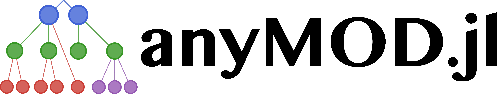

[anyMOD.jl](https://github.com/leonardgoeke/anyMOD.jl) is a [Julia](https://julialang.org/) framework to create large scale energy system models with multiple periods of capacity expansion. It was developed to address the challenges in modelling high-levels of intermittent generation and sectoral integration. Its documentation can be found [here](https://leonardgoeke.github.io/anyMOD.jl/dev/).

A comprehensive description of the framework's graph based methodology can found in the working paper [Göke (2020), anyMOD - A graph-based framework for energy system modelling with high levels of renewables and sector integration](https://arxiv.org/abs/2004.10184). Its key characteristic is that all sets (time-steps, regions, energy carriers, and technologies) are organized within a hierarchical tree structure. This allows for two unique features:
* The level of temporal and spatial granularity can be varied by energy carrier. For instance, electricity can be modelled with hourly resolution, while supply and demand of gas is balanced daily. As a result, a substantial decrease of computational effort can be achieved. In addition, flexibility inherent to the system, for example in the gas network, can be accounted for.
* The degree to which energy carriers are substitutable when converted, stored, transported, or consumed can be modelled. As an example, residential and district heat can both equally satisfy heat demand, but technologies to produce these carriers are different.

The framework requires [Julia 1.3.1](https://julialang.org/downloads/oldreleases/) since all computationally intensive steps are parallelized using multi-threading and relies on [DataFrames](https://juliadata.github.io/DataFrames.jl/stable/) and [JuMP](https://github.com/JuliaOpt/JuMP.jl) as a back-end. The repository [anyMOD_example_model](https://github.com/leonardgoeke/anyMOD_example_model) demonstrates how the framework can utilize version-control to openly share and develop models.

The current roadmap for development is to extend documentation and introduce additional parameters and constraints features (must-run, demand-side management, etc.). The development of anyMOD is receiving funding from the European Union’s Horizon 2020 research and innovation programme under grant agreement No 773406.

If you have any questions, need help, or found a bug, please file a GitHub issue.
