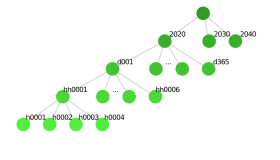
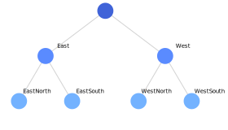
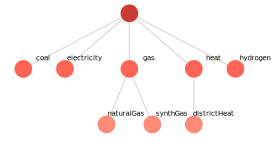
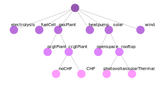

All model sets are created based on a table from a corresponding csv file. To organize sets within a hierarchical tree structure, each level of the tree corresponds to a column in the table. By writing a set name into a column, a node is created on the respective level of the table. If several set names are written into the same row, these nodes are connected via an edge of the tree. The reserved keyword `all` is a placeholder for all nodes defined on the respective level and facilitates the creation of large trees.

The input tables for `carrier` and `technology` have additional columns to define further attributes of nodes as documented below. To document the purpose of these columns, the set tables of the example model and their corresponding trees are listed below. All plots were created using the [`drawNodeTree`](@ref) function.
## Timestep
All timesteps within the model are provided by the `set_timestep.csv` file.

| timestep_1 | timestep_2 | timestep_3 | timestep_4 |
|------------|------------|------------|------------|
| 2020       |            |            |            |
| 2030       |            |            |            |
| 2040       |            |            |            |
| all        | d001       | hh0001     | h0001      |
| all        | d001       | hh0001     | h0002      |
| all        | d001       | hh0001     | h0003      |
| all        | d001       | hh0001     | h0004      |
| all        | d001       | hh0002     | h0005      |
| ...        | ...        | ...        | ...        |

Here the `all` keyword is used to avoid the repetition of the day/4-hour step/hour part of the table for each year. The example also demonstrates, that node names are not unique, because different nodes on the same level can be named `d001`, for example. The plot below obviously only shows a section of the corresponding tree.

## Region
Regions are defined within the `set_region.csv` file.

| region_1 | region_2  |
|----------|-----------|
| East     | EastNorth |
| East     | EastSouth |
| West     | WestNorth |
| West     | WestSouth |

The table leads to the following simple tree.

## Carrier
All carriers within the model are provided by the `set_carrier.csv` file.

| carrier_1   | carrier_2    | timestep_dispatch | timestep_invest | region_dispatch | region_invest |
|-------------|--------------|-------------------|-----------------|-----------------|---------------|
| electricity |              | 4                 | 1               | 1               | 2             |
| heat        | districtHeat | 3                 | 1               | 2               | 2             |
| gas         | naturalGas   | 2                 | 1               | 1               | 1             |
| gas         | synthGas     | 2                 | 1               | 1               | 1             |
| coal        |              | 1                 | 1               | 1               | 1             |
| hydrogen    |              | 1                 | 1               | 1               | 1             |

In addition to the carrier tree itself, the file also defines the carrier-specific temporal and spatial resolution for dispatch and investment by providing the respective levels. There are certain restrictions on the relation of these levels for each carrier:

* ``timestep\_dispatch \leq timestep\_invest  \Rightarrow`` temporal resolution of dispatch needs to be at least as detailed as temporal resolution of investment
* ``region\_invest \leq region\_dispatch  \Rightarrow`` spatial resolution of investment needs to be at least as detailed as spatial resolution of dispatch

The resolution of carriers without a separate row in the input table is set to the coarsest resolution of all its children.

## Technology
Technologies are defined within the `set_technology.csv` file. Only nodes at the end of a branch correspond to an actual technology and all other nodes are used to enable inheritance of parameters and setting of limits. Referring to the table below for example, any availability parameter provided for `solar` would ultimately be inherited by `openspace`, `photovoltaic` and `solarThermal`. Furthermore, any limit on the installed capacites of `rooftop` would apply to the **sum** of `photovoltaic` and `solarThermal` capacities.

| technology_1 | technology_2 | technology_3 | mode               | carrier\_conversion\_in | carrier\_conversion\_out           | carrier\_stored\_in | carrier\_stored\_out | technology\_type | region\_disaggregate |
|--------------|--------------|--------------|--------------------|-----------------------|----------------------------------|-------------------|--------------------|-----------------|---------------------|
| wind         |              |              |                    |                       | electricity                      |                   |                    | mature          | yes                 |
| solar        | openspace    |              |                    |                       | electricity                      |                   |                    | mature          | yes                 |
| solar        | rooftop      | photovoltaic |                    |                       | electricity                      |                   | electricity        | mature          | yes                 |
| solar        | rooftop      | solarThermal |                    |                       | heat                             |                   | heat               | mature          | yes                 |
| gasPlant     | ccgtPlant    | noCHP        |                    | gas                   | electricity                      |                   |                    | stock           | no                  |
| gasPlant     | ccgtPlant    | CHP          | moreHeat; moreElec | gas                   | electricity; heat < districtHeat |                   |                    | mature          | no                  |
| gasPlant     | ocgtPlant    |              |                    | gas                   | electricity                      |                   |                    | mature          | no                  |
| heatpump     |              |              |                    | electricity           | heat                             |                   |                    | mature          | no                  |
| electrolysis |              |              |                    | electricity           | hydrogen                         |                   |                    | emerging        | no                  |
| fuelCell     |              |              |                    | hydrogen              | electricity; heat                |                   |                    | emerging        | no                  |

The technology table includes a lot of additional columns that characterize the specific technology. If a column contains multiple values, these need to be separated by `; `.

* **Modes**\
    Each technology can have a arbitrary number of operational modes, that can effect all its dispatch related parameters (efficiency , availability, variable cost etc.). Since we do not use any integer variables, these modes are not exclusive. Instead, the current operating status can be any linear combination of all modes defined.
* **Technology carriers**\
    Carriers below the tree's top level have to be provided with a ` < ` (as a symbolization of the tree's edges) between the name of the different nodes.
    - __conversion:__ Input and output carriers to the conversion process of the respective technology.
    - __storage:__ Carriers the technology can charge (input) or discharge (output) to the energy balance of the respective carrier. It is reasonable to have a carrier, that can only be discharged to the energy balance, if at the same carrier it is an output of the conversion process. The same applies vice versa to conversion inputs and charging.
* **Type of technology**\
    This column controls how investment into the respective technology is handled. The column allows for three different keywords:
    - *stock*: Technology does not allow investment and can only be used where residual capacities are provided.
    - *mature:* Dispatch related parameters (efficiency , availability, variable cost etc.) cannot depend on the period of capacity investment. However, all its investment related parameters (lifetime, investment costs etc.) still can be time-dependent.
    - *emerging:* Dispatch related parameters can vary by the period of capacity investment.

!!! warning

    For emerging technologies, the number of dispatch variables and constraints exponentially grows with the number of investment timesteps. Otherwise, the dependency between period of investment and dispatch parameters cannot be modelled. Therefore, emerging technologies should be chosen carefully.
* **Disaggregate regions**\
    By default the spatial dispatch level of each technology is determined by the spatial dispatch level of its carriers. Consequently, in our case each technology producing electricity would be dispatched at the spatial level 1. Even though its spatial investment level is 2, for dispatch constraints all capacities would be aggregated on level 1. As a result, different availability curves for renewables in different regions of the same country could not be modelled. To prevent this, the `region_disaggregate` column can be set to `yes` to ensure the respective technology is always dispatched at the spatial investment instead of the spatial dispatch level.

